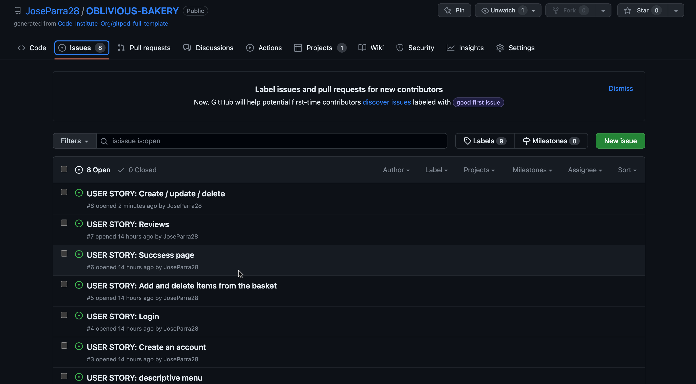
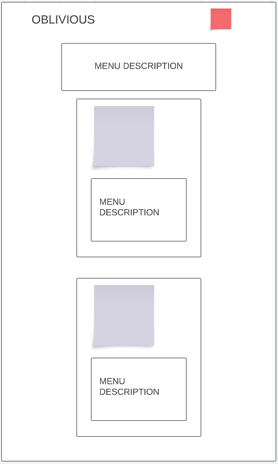
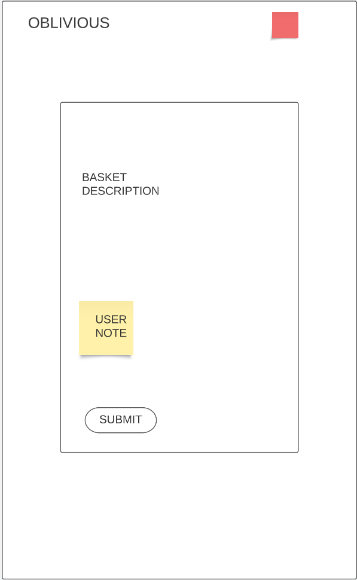
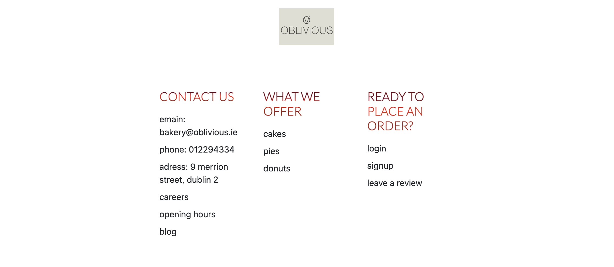
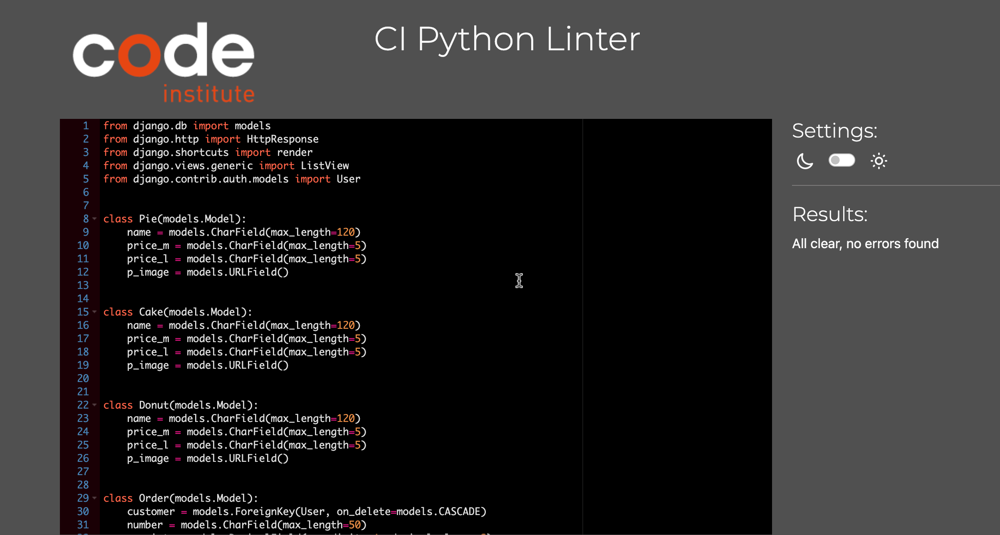

# Oblivious bakery

 ## Oblivious bakery, is a fictional bakery website. The signature of this business is that when am user places an order, they get a complimentary pastry, but they won't find out until they receive it, hense the name Oblivious 

[Live link to website here](https://oblivious-bakery.herokuapp.com/)

---

## CONTENTS

* [User Experience](#user-experience-ux)
  * [User Stories](#user-stories)

* [Design](#design)
  * [Colour Scheme](#colour-scheme)
  * [Typography](#typography)
  * [Images](#images)
  * [Wireframes](#wireframes)

* [Features](#features)
  * [Future Implementations](#future-implementations)
  * [Accessibility](#accessibility)

* [Technologies and Languages Used](#technologies-used)
  * [Database design](#database-design)
  * [Models](#models)

* [Agile development](#agile-development)
  * [GitHub projects](#github-projects)
  * [GitHub issues](#github-issues)
* [Testing](#testing)
* [Deploiment](#deploiment)
  * [Customized deployment](#customized-deployment )
* [Reference material](#reference-material)
* [Credits](#credits)

---

## User Experience (UX)
I wanted to keep the design quite simple on this site so as to not distract the user. I used the main linear gradient colour throughout the site to establish a brand with oblivious. The off-white colour I used for my background look and the 
dark-gray for my font color was used to keep it simple but appealing.

### Colour Scheme

| HEX            | Placemnet.    |
| -------------  | ------------- |
| `#f5f5f5`      |Backgound color|
| `#424040`      | Font color    |
|     Linear-gradient colors     |
|                |               
| `#782b25`      | Falu red
| `#a23930`      | Auburn
| `#872b20`      | Burnt umber
| `#d9402f`      | Chilli red
| `#61111f`      | Chocolate cosmos
| `#6a1818`      | Rosewood

I used [coolors.co](https://coolors.co/) to generate my colour palette.

I've used CSS :root variables to easily update the global colour scheme by changing only one value, instead of everywhere in the CSS file.
I have also set the values of h1, h2, h3, p, and button values at the beginning of the main css page to avoid rewriting them.
I created 4 css files to keep the code more organised. These being MAIN, COLORS, MENU, FORMS.css.

## Typography

- Lato
- Sans-serif 
- Font awsome for icons

## Images

### Logo

Site's logo was created by myself using photoshop.

Images were carefully selected to reflect the purpose of this site. 
menu images were attached to it's respective model and item. I have used [Cloudinary](https://cloudinary.com/) to add custom images to the each item.

## User Stories

### New Site Users
- As a new site user, I would like to clearly see the site's purpose, so that I can decide whether or not to sign up. (MUST HAVE)
- As a new site user, I would like to sign up for the site and create an account, so that I can create my profile and start ordering from the site. (MUST HAVE)
 

 - Issues

 

### Registered Users
- As a registered user, I would like to log in to my account, so that I can access the site. (MUST HAVE)
- As a registered user, I would like to log out of my account, so that I can end my session on my current device. (MUST HAVE)
- As a registered user, I would like to create a new review, so that I can share my thoughts with other customers. (MUST HAVE)
- As a registered user, I would like to delete my review, so that I can remove content that I no longer want published. (MUST HAVE)
- As a registered user, I would like to easily navigate the site, so that I can access what I need at the click of a button. (MUST HAVE)
- As a registered user, I would like to reset my password if I forget it, so that I can regain access to my account. (SHOULD HAVE)

# Wireframes

### Click the arrow to drop down the menu

Landing page

- Desktop

- Mobile and tablet

Menu description page

- Desktop

- Mobile and tablet

Menu page

- Desktop

- Mobile and tablet

Forms page

- Desktop

- Mobile and tablet

Order summary page

- Desktop

- Mobile and tablet

Success page

- Desktop

- Mobile and tablet

--- 
# Features 
This site was created specifically for an intuitive navigation. With clear pictures, description of the bussiness and its staff to add a personal touch to it. 
## Existing Features
  - Landing Page

This is the page a user lands on when arriving at the site for the first time or before they've logged in if they don't have an active session. It welcomes them to the site and gives them a brief description of the company as well as staff. If the user is logged in they will get an indication that they are by having the logout button in the navigation bar.

  -  About section
The about section is found in the home page, desided to do this instead of creating a new page all together.

  - Review section 
The review section can be found right under the About section, this is where users can write a review, edit and delete. Only authenticated can write revies, not account holders with be able to see the review but not who wrote them to protect their identity.

  - Meet the team section
This is where users can meet the team, and read a little bit about their background.  

  - Footer
The footer contains future links such as career etc. It will also contain contact information.

  - Menu
The menu contains a brief description of the company’s menu as well as manu cards with the description of the item and a button to access the add items page. 
- Menu preview

  - Cakes, Pies, Donuts
With a model for each item users can add the items of their choice and the size of their choice,they can browse through the site and add the items they want to the basket-preview and they will also be able to remove the item if they wish. The `check out` button with brinf them to the submit order page. 

  - Basket 
Here users can see what they have added and what they will be purchasing, they can also delete any item that they added if they change their mind. They can also leave an note to customise their order a bit more.

 
- Order summary ready to check out.

  - Login
Users can login if they have an accound with us, if not, they will have a button to sign up that will redirect them to signup form.

  - Signup
User can create an account if they don't have one with us. They need a username, e-mail, name, password and rewrite password. The form was done with Django's NewUserForm so that that they enter a strong password. Their data will be stored in the database.

  - Success page
After submiting their order users are redirected to the susscess page. Here they can either go back home of logout.

# Future implementations

  - Full payment system 
  - Change password
  - Allow the user to add an image to their account
  - Review likes

# Accessibly 
I created the website simple enough so that any user is able to see, read and navigate through the website
After passing through the Lighthouse in devtool the font choose is clearly readable.

# Technologies and Languages Used
- [HTML](https://en.wikipedia.org/wiki/HTML)used for the main site content.
- [CSS](https://en.wikipedia.org/wiki/CSS) used for the main site design and layout.
- [CSS :root](https://www.w3schools.com/css/css3_variables.asp)variables used for reusable styles throughout the site.
- [Bootstrap](https://getbootstrap.com/) used as the front-end CSS framework for modern responsiveness and pre-built components.
- [Javascript](https://www.javascript.com/) used for user interaction on the site to handle the notification dropdown and notification delete functions, menu cart and orders.
- [Python](https://www.python.org/) used as the back-end programming language.
- [Git](https://git-scm.com/) Git used for version control. (git add, git commit, git push)
- [GitHub](https://github.com/) used for secure online code storage.
- [Gitpod](https://gitpod.io/workspaces) used as a cloud-based IDE for development.
- [Django](https://www.djangoproject.com/) used as the Python framework for the site.
- [PostgreSQL](https://www.postgresql.org/) used as the relational database management.
- [ElephantSQL](https://www.elephantsql.com/) used as the Postgres database.
- [Heroku](https://dashboard.heroku.com) used for hosting the deployed back-end site.
- [Cloudinary](https://cloudinary.com/) used for online static file storage.
- [Adobe Photoshop](https://www.adobe.com) used to create the logo
- [Lucidchart](https://www.lucidchart.com) used to create the database design and the wireframes

# Database Design
I created an entity relationship diagram using Diagrams.net. This helped me to visualize the relationships between my data structures and made the development process easier as I had everything mapped out in front of me for reference to avoid having to reference each models.py file individually.

## Models

   - Pie
   - Cake
   - Donut

| PK      | ID(unique)  | Type       |
| --------| ----------- | -----      |
| FK      |   name      | ChardField |
|         |   price_m   | ChardField |
|         |   Price_l   | ChardField |
|         |   p_image   | URLField   |

   - Order

| PK      | ID(unique)  | Type         |
| --------| ----------- | -----        |
| FK      |   Customer  | ForeignKey   |
|         |   number    | ChardField   |
|         |   receipt   | DecimalField |
|         |   date      | DateTimeField|
|         |   notes     | TextField    | 

   - Item

| PK      | ID(unique)  | Type         |
| --------| ----------- | -----        |
| FK      |   order     | ForeignKey   |
|         |   name      | ChardField   |
|         |   price     | DecimalField |
|         |   size      | DateTimeField|

   - Itemm

| PK      | ID(unique)  | Type         |
| --------| ----------- | -----        |
| FK      |   name      | Chardfield   |
|         |   done      | BooleanField |

# Agile development

## GitHub Projects
GitHub Projects served as an Agile tool for this project. It isn't a specialized tool, but with the right tags and project creation/issue assignments, it was made to work.

Through it, user stories were used to map out the development progress of the project using the basic Kanban board. It helped me to see the backlog of work I needed to complete and move tasks across as I worked on them before testing and signing off to finish them.

## GitHub issues
GitHub Issues served as an another Agile tool. There, I used my own User Story Template to manage user stories

# Testing

HTML

I have used the recommended HTML W3C Validator to validate all of my HTML files.

As my project uses Jinja syntax, such as , , and {{ variable|filter }} it will not validate properly if I copy and paste into the HTML validator straight from my source files.

Usually in order to properly validate these types of files, it's recommended to validate by uri from the deployed Heroku pages.

Unfortunately, nearly all of the pages on this site require a user to be logged-in and authenticated, and will not work using this method, due to the fact that the HTML Validator (W3C) doesn't have access to login to the pages.

In order to properly validate my HTML pages with Jinja syntax for authenticated pages, I followed these steps:

- Navigate to the deployed pages which require authentication
- Right-click anywhere on the page, and select View Page Source (usually CTRL+U or ⌘+U on Mac).
- This will display the entire "compiled" code, without any Jinja syntax.
- Copy everything, and use the validate by input method.
- Repeat this process for every page that requires a user to be logged-in/authenticated.

CSS

- Tested the code returning no errors

  

Javascript

- Tested the code returning 0 errors.
- There are 11 funtions in this file.
- The most complex function has a cyclomatic complexity value of 2 while the median is 1.
- Ran the tests on [JShint](https://jshint.com/)

Python

- Tested the my written code in CodeInstitute CI Python linter and found zero errors.

   - Views

   

   - Models

   
   

# Deploiment

[Heroku live deploiment](https://oblivious-bakery.herokuapp.com/)

## ElephantSQL Database

### This project uses [PostgreSQL](https://www.postgresql.org/) for the PostgreSQL Database.

To obtain your own Postgres Database, sign-up with your GitHub account, then follow these steps:

- Click Create New Instance to start a new database.
- Provide a name (this is commonly the name of the project: tribe).
- Select the Tiny Turtle (Free) plan.
- You can leave the Tags blank.
- Select the Region and Data Center closest to you.
- Once created, click on the new database name, where you can view the database URL and Password.

## Cloudinary API

### This project uses the Cloudinary API to store media assets online, due to the fact that Heroku doesn't persist this type of data.

To obtain your own [Cloudinary API](https://cloudinary.com/) key, create an account and log in.

- For Primary interest, you can choose Programmable Media for image and video API.
- Optional: edit your assigned cloud name to something more memorable.
- On your Cloudinary Dashboard, you can copy your API Environment Variable.
- Be sure to remove the CLOUDINARY_URL= as part of the API value; this is the key.

## Heroku Deployment
This project uses [Heroku](https://dashboard.heroku.com), a platform as a service (PaaS) that enables developers to build, run, and operate applications entirely in the cloud.

Deployment steps are as follows, after account setup:

- Select New in the top-right corner of your Heroku Dashboard, and select Create new app from the dropdown menu.
- Your app name must be unique, and then choose a region closest to you (EU or USA), and finally, select Create App.
- From the new app Settings, click Reveal Config Vars, and set your environment variables.
- Key	Value
   - CLOUDINARY_URL	insert your own Cloudinary API key here
   - DATABASE_URL	insert your own ElephantSQL database URL here
   - DISABLE_COLLECTSTATIC	1 (this is temporary, and can be removed for the final deployment)
   - SECRET_KEY	this can be any random secret key

## Heroku needs two additional files in order to deploy properly, and in my case I needed to create runtime.txt and install an compatible vertion of Python.

   - requirements.txt
   - Procfile
   - runtime.txt

You can install this project's requirements (where applicable) using:

   - pip3 install -r requirements.txt
If you have your own packages that have been installed, then the requirements file needs updated using:

   - pip3 freeze --local > requirements.txt
The Procfile can be created with the following command:

   - echo web: gunicorn app_name.wsgi > Procfile
   - replace app_name with the name of your primary Django app name; the folder where settings.py is located
For Heroku deployment, follow these steps to connect your own GitHub repository to the newly created app:

Either:

   - Select Automatic Deployment from the Heroku app.
Or:

   - In the Terminal/CLI, connect to Heroku using this command: heroku login -i
   - Set the remote for Heroku: heroku git:remote -a app_name (replace app_name with your app name)
   - After performing the standard Git add, commit, and push to GitHub, you can now type:
      - git push heroku main
The project should now be connected and deployed to Heroku!   

# Customized deployment 
I have follow the steps as above to deploy my app however, I did run with a couple of issues while doing so. 
I contacted tutor assistant and recived much appreciated support from one of the tutors. All i needed was to update some vertion of my installed files. After doing this, the app was up and running.

- Reference Material
Used Django decumentation to help me through the building of this site, as well as Stack overflow to help me solve some small errors and issues i came across

# Credits

- Add a review code is from Code Institute CodeStart follow along project
- Sign in and sigh out form is Django documentations
- Restaurant booking system models inspiration from [DarshanDev](https://www.youtube.com/@darshandev1754)

